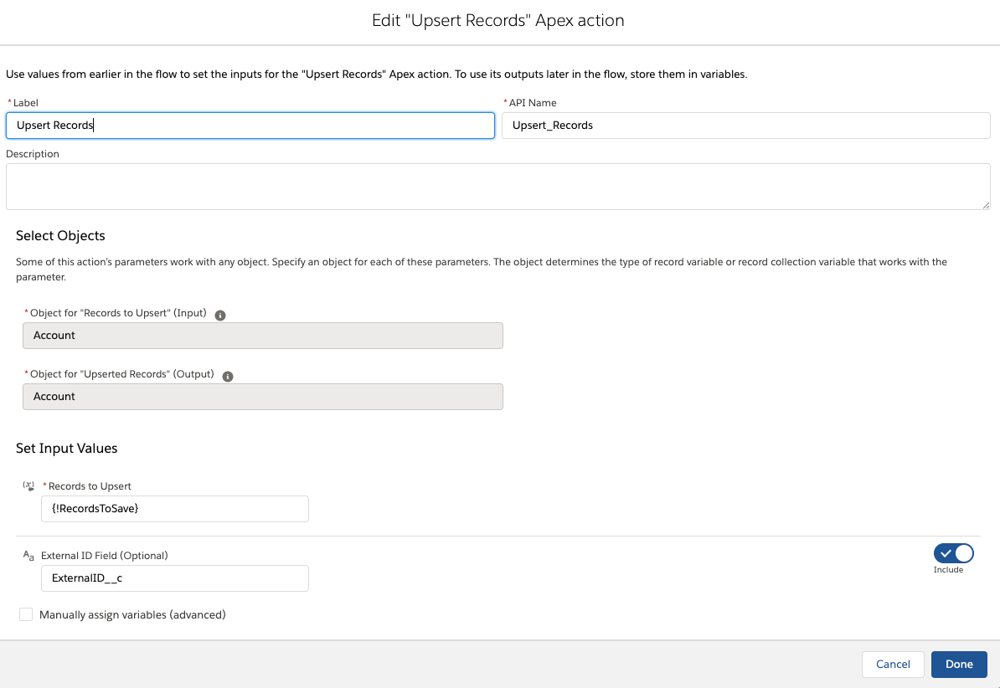

# Upsert Records Lightning Flow Action

 This repo contains an Apex Invocable Action that provides the ability to Upsert Records in Lightning Flow from Salesforce.

## Input values
 * Records to Upsert - set this value to a collection variable containing the records you'd like to upsert
 * External ID Field - an optional setting to define the API name of the field that is marked as an [External ID](https://help.salesforce.com/articleView?id=custom_field_attributes.htm&type=5) in your record collection 
   - If you leave this field empty, the Upsert Records Action will use the default Apex [upsert](https://developer.salesforce.com/docs/atlas.en-us.apexcode.meta/apexcode/langCon_apex_dml_examples_upsert.htm) behavior which expects the ID field to be populated on any existing records within your collection variable. Any records not having an ID value will be inserted rather than updated

For more information about Apex Action flow elements, see https://help.salesforce.com/articleView?id=flow_ref_elements_apex_invocable.htm&type=5

## Output values

The output collection will contain the same records provided as input except for any new records - new records inserted will have their ID values populated. 

 * By default, Lightning Flow will automatically map the output collection to a variable.
 * You can also manually assign the output to a variable you define in your flow.